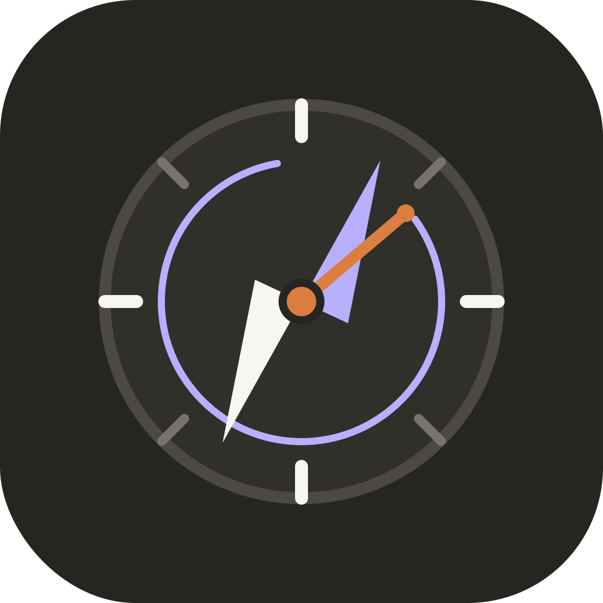

<div align="center">
  

  # Compasso

  **Every Second Counts**

  Um sistema pessoal, local-first, para transformar leitura, estudo e metas em progresso visível.

  [](https://developer.mozilla.org/docs/Web/Progressive_web_apps)
  [](#privacidade)
  [](https://pages.github.com/)

  [Abrir aplicativo](https://giuseppebruno-py.github.io/every-second-counts-app/) · [Funcionalidades](#funcionalidades) · [Executar localmente](#executar-localmente)
</div>

---

## Sobre

O **Compasso** reúne acompanhamento de progresso e gestão de conhecimento em uma única interface inspirada em ferramentas como o Obsidian, mas orientada à execução.

Cada área utiliza uma unidade concreta:

| Área | Unidade de progresso | Exemplo |
| --- | --- | --- |
| Leituras físicas | Páginas | 120 de 300 páginas |
| Leituras digitais | Percentual | 42% no Kindle |
| Estudos | Horas | 4 de 10 horas |
| Metas | Dias | 7 de 30 dias |

O percentual e o restante são calculados automaticamente.

## Funcionalidades

- Dashboard com visão consolidada das frentes ativas.
- Visão **Hoje** com plano diário curto e próximas ações.
- Criação manual de ações independentes ou vinculadas a uma frente.
- Fila inteligente baseada no foco semanal e nas frentes ativas.
- Leituras físicas acompanhadas por página atual e total da edição.
- Leituras digitais acompanhadas pelo percentual exibido no Kindle.
- Estudos acompanhados por horas concluídas e planejadas.
- Metas acompanhadas por dias executados e planejados.
- Sessões de leitura e estudo com início, pausa, retomada e encerramento.
- Recuperação da sessão ativa após fechar ou recarregar o PWA.
- Evidências estruturadas vinculadas às sessões concluídas.
- Active Recall com perguntas derivadas de evidências e notas.
- Modo de prática com resposta oculta, edição e histórico de tentativas.
- Revisão espaçada com fila de cards devidos e autoavaliação em quatro níveis.
- Diagnóstico automático de assuntos fracos baseado no histórico de recuperação.
- Caderno de erros com causa, correção, próxima ação e acompanhamento de resolução.
- Planejado vs. realizado semanal com ações, sessões, tempo e evidências.
- Síntese orientada de livros com geração de nota Markdown vinculada.
- Histórico de sessões por item e histórico global pesquisável.
- Métricas de tempo focado, dias ativos, consistência e sequências.
- Tendência das últimas oito semanas e ranking por investimento.
- Revisão semanal guiada por sessões e evidências.
- Prioridades semanais conectadas ao foco do dashboard.
- Grafo interativo de leituras, estudos, metas e notas.
- Nós arrastáveis, pan, zoom por roda ou gesto de pinça e enquadramento automático.
- Seleção de vizinhos, painel contextual, busca com foco e filtros por domínio.
- Dicionário editorial como visualização alternativa do mesmo modelo de relações.
- Relações bidirecionais derivadas de `[[wikilinks]]` e notas vinculadas.
- Navegação direta entre entradas relacionadas e suas origens.
- Exportação do histórico filtrado em CSV.
- Atlas de notas com pastas e arquivos Markdown.
- Importação e exportação do Atlas como vault Markdown em ZIP ou pasta.
- Manifesto opcional para preservar IDs, tags, pastas e vínculos em round-trip.
- Importação segura por mesclagem, cópia isolada ou substituição somente do Atlas.
- Compatibilidade com vaults Markdown externos e frontmatter YAML básico.
- Editor dividido entre escrita e visualização.
- Tags, links `[[wikilinks]]` e notas vinculadas a itens de progresso.
- Filtros, busca e estados de andamento.
- Backup e restauração em JSON.
- Instalação como aplicativo PWA.
- Funcionamento offline após o primeiro carregamento.

## Privacidade

O Compasso segue uma abordagem **local-first**:

- O repositório contém somente dados de demonstração genéricos.
- Leituras, notas, estudos, metas, sessões, evidências e revisões ficam no armazenamento local do navegador.
- Nenhum dado pessoal é enviado ao GitHub ou a um servidor externo.
- Backups JSON, vaults Markdown e relatórios CSV são exportados apenas quando o usuário solicita.
- A análise de ZIPs e pastas Markdown ocorre integralmente no navegador.

> Limpar os dados do navegador pode remover o conteúdo local. Exporte backups periodicamente.

## Instalação

1. Abra o [Compasso publicado](https://giuseppebruno-py.github.io/every-second-counts-app/) no Chrome ou Edge.
2. Clique no ícone de instalação exibido na barra de endereço.
3. Confirme **Instalar**.
4. O aplicativo ficará disponível no menu Iniciar e poderá funcionar offline.

Ao migrar de uma instalação local, exporte o backup JSON antigo e importe-o uma única vez no endereço publicado.

## Arquitetura

```text
index.html
├── interface principal
├── modelo de progresso
└── editor Markdown

storage.js
└── persistência IndexedDB com contingência local

today-feature.js
└── plano diário e próximas ações conectadas às sessões

sessions-feature.js
└── sessões de leitura e estudo

evidence-feature.js
└── evidências vinculadas às sessões

recall-feature.js
└── perguntas de Active Recall derivadas de evidências e notas

weakness-feature.js
└── assuntos fracos e caderno de erros acionável

outcomes-feature.js
└── planejado vs. realizado e sínteses orientadas de livros

weekly-review-feature.js
└── revisão semanal guiada

analytics-feature.js
└── consistência, tendências e histórico global

dictionary-relations-feature.js
└── modelo editorial e relações entre conhecimento e objetivos

knowledge-graph-feature.js
└── visualização force-directed, interações e painel contextual

markdown-vault-feature.js
└── exportação ZIP/pasta, leitura de vault e estratégias de importação

markdown-vault-hardening.js
└── preservação de pastas vazias e coerência dos controles assíncronos

manifest.webmanifest
└── identidade e instalação PWA

service-worker.js
└── composição do app shell, cache e funcionamento offline
```

O projeto não exige framework, banco de dados remoto ou processo de build. A aplicação é entregue como arquivos estáticos pelo GitHub Pages.

## Executar localmente

Clone o repositório e sirva a pasta com qualquer servidor HTTP estático:

```bash
git clone https://github.com/GiuseppeBruno-Py/every-second-counts-app.git
cd every-second-counts-app
python -m http.server 4173
```

Depois acesse:

```text
http://localhost:4173
```

## Atualizações

Novos commits na branch `main` são publicados pelo GitHub Pages. O service worker detecta a nova versão e substitui o cache anterior.

## Roadmap orientado ao ciclo de aprendizagem

O desenvolvimento segue o fluxo:

**Planejar → Executar → Registrar evidência → Recuperar → Refletir → Ajustar**

| Fase | Entrega | Estado |
| --- | --- | --- |
| 0 · Fundação local-first | IndexedDB, migração do `localStorage`, schema versionado, backup e restauração | ✅ Concluída |
| 1 · Execução guiada | Hoje, sessões, próximas ações, evidências, metas/foco conectados e revisão semanal | ✅ Concluída |
| 2 · Aprendizagem ativa | Active Recall, revisão espaçada, assuntos fracos, caderno de erros, síntese de livros e planejado vs. realizado | ✅ Concluída |
| 3 · Integrações | Google Drive, Markdown/Obsidian, Anki, Kindle/Readwise e calendário | 🟡 Parcial: vault Markdown concluído |
| 4 · IA contextual | RAG sobre dados locais, geração de perguntas e avaliação de explicações | 📋 Planejada |

### Fluxo já disponível

1. Defina a **Próxima evidência** em uma leitura, estudo ou meta.
2. Selecione prioridades na **Revisão semanal**.
3. Transforme essas prioridades em ações na visão **Hoje**.
4. Inicie uma sessão de leitura ou estudo.
5. Registre progresso e evidência ao encerrar.
6. Analise consistência e feche a semana com decisões para o próximo ciclo.

### Próximos incrementos

- Fase 3: sincronização opcional entre dispositivos pelo Google Drive, com IDs permanentes, `updatedAt` e merge por registro.
- Evolução contínua de acessibilidade e experiência mobile.

---

<div align="center">
  <strong>Compasso</strong><br />
  Direção para o que importa. Consistência em cada segundo.
</div>
